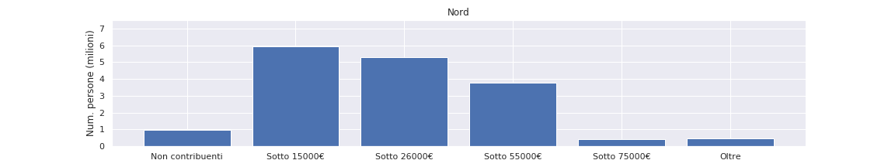
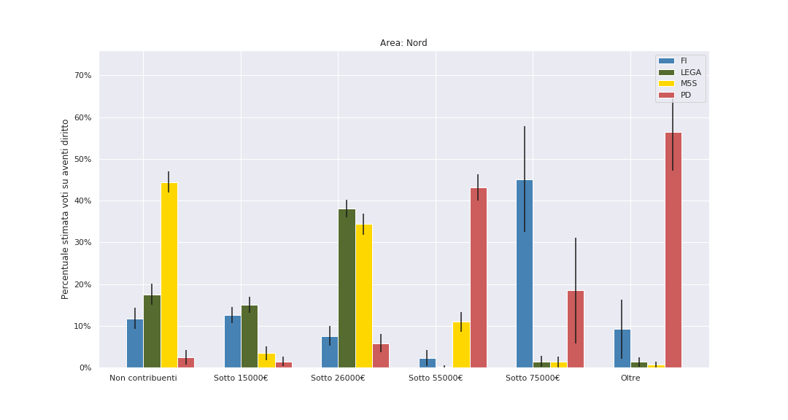
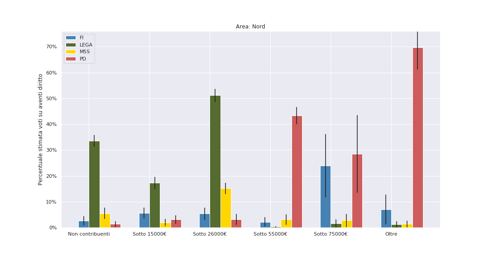

# Classi sociali nelle elezioni 2018 e 2019: un'analisi bayesiana del voto

**Come hanno votato le classi sociali?** Sappiamo che una *classe in sè* che esiste nella società non sempre diventa una *classe per sè*, coscente dei suoi interessi e capace di organizzarli in forma di partito. Se la divisione tra chi ha molto e chi ha poco era alla base delle divisioni dei partiti politici dalla loro nascita, le *classi per sè* si sono affievolite molto negli ultimi decenni. La nascita di partiti "pigliatutto", pronti a sostenere qualunque politica e il suo opposto, ha appiattito molte differenze; tanto più da quando negli anni '90 qualcuno ha teorizzato la fine della Storia, intendendo la fine dello scontro sociale (s'è visto). E oggi, tra sinistra di destra e populismi vari, è sempre più difficile dire chi rappresenta chi.

Siamo tutti d'accordo: c'è stato un continuo sgretolamento delle "identità di classe", e una corrispondente agonia dei "partiti di classe". Questo a vantaggio di partiti pigliatutto, determinati da immagini mediatiche dei leader, e di partiti di notabili, ormai guidati direttamente dai Berlusconi o dai Trump che perseguono propri interessi. Ma noi sappiamo che sono gli interessi di classe a muovere la Storia. 

Quindi, proviamo a indagare coi dati la questione di chi rappresenta chi – e di chi *non* è rappresentato affatto. Useremo la statistica bayesiana per fare luce sulla questione: col teorema di Bayes, si parte da un'ipotesi a priori e la si modifica guardando la realtà dei dati. Così faremo. La nostra ipotesi di base è che **possiamo individuare nei voti una logica che dipende dal portafogli**. Quello che ci faremo dire dai dati è come si muovono questi voti tra i vari partiti italiani, confrontando le **elezioni politiche del 2018** e quelle **europee del 2019**.

## L'analisi

Questa analisi, insomma, si basa su una stima di come hanno votato le diverse classi di reddito, nel Nord, nel Centro, e nel Sud. **Non ci basiamo su nessun sondaggio**: consideriamo soltanto *le schede nelle urne* e le *dichiarazioni dei redditi* [1]. La spiegazione dei dettagli matematici è in fondo dell'articolo, ma il succo è questo: proviamo a far corrispondere il voto di una certa classe di reddito con quante schede sono effettivamente state contate, e cerchiamo l'ipotesi che funziona meglio sui migliaia di comuni considerati. Dal momento che per ciascun comune sappiamo sia quante persone appartengono a ogni fascia di reddito, sia quanti voti ha preso un certo partito, troviamo le percentuali cha fanno "quadrare i conti" per tutti i partiti (e per l'astensione).

Come ogni analisi statistica ci sono delle puntualizzazioni da fare. La prima è che non abbiamo certezza sul rapporto causa-effetto: l'ipotesi proposta è quella più semplice, rasoio di Occam alla mano: se nei comuni dove ci sono molti ricchi, un partito prende tanti voti, è perchè sta prendendo più voti in quella classe.

Per questo motivo, **non consideriamo comuni sopra i 100 000 abitanti**, cercando di eliminare ogni possibile fattore di confusione. L'analisi proposta si basa infatti su una divisione ISTAT comune per comune: ma i grossi comuni hanno una distribuzione di voto e di classe particolare, ma sono troppo pochi per fare un'analisi separata (sono 45 sui 7800 considerati). Tutte le conclusioni che proponiamo valgono perciò solo per i comuni sotto i 100 000 abitanti.

Infine, non consideriamo le regioni Val D'Aosta e Trentino Alto Adige: la presenza di partiti locali autonomi rende lo scenario politico in queste regioni radicalmente diverso. Divideremo quindi l'Italia in tre aree: Nord (senza Val D'Aosta e Trentino), Centro e Sud.

## Le classi considerate

Iniziamo mostrando cosa intendiamo per *classe di reddito*. Nonostante i dati ISTAT ci consentirebbero di analizzare altre distinzioni di classe, come esempio salariati e non, sarebbe difficile distinguere il lavoro autonomo, ma di fatto salariato, di una finta partita IVA da quello di chi paga decine di persone. Per questo motivo ci siamo basati unicamente su una versione semplificata delle fascie di reddito ISTAT. Distinguiamo quindi cinque classi di reddito:

- Chi guadagna **sotto i 15 mila euro annui**, fascia di reddito bassa. Qui troviamo per esempio pensionati con la "minima" – la media nazionale dei redditi da pensione è 14.665 euro – così come molti lavoratori, principalmente salariati. Ricordiamo che la soglia di povertà in Italia si aggira sui 9 mila euro annui: questa fascia di reddito comprende anche loro. In ognuna delle tre aree considerate, è la classe più popolosa: 6 milioni di persone al Nord, 5 al centro e quasi 7 al Sud.

- Chi sta tra i **15 e i 26 mila euro**: fascia medio-bassa. In questa fascia in generale ci aspettiamo di trovare il grosso dei lavoratori salariati: il lavoratore dipendente medio in Italia guadagna 17.370 euro. Da [2]: *"Il  reddito  medio  da  lavoro  dipendente  raggiunge  il  picco  di  circa  20.490  euro  in  corrispondenza  della  classe prossima  al  pensionamento e scende  rapidamente  a  16.360  euro  tra  gli  ultrasessantacinquenni"*.  Sono la seconda fascia più popolosa: 5 milioni di persone al Nord, tra i 3 e 4 sia al Centro che al Sud.

- Chi sta tra i **26 e i 55 mila euro**: fascia medio-alta. *Middle class* e *upper-middle class*: rientrano in questa fascia tipicamente lavoratori in proprio – il reddito medio di un lavoratore autonomo è di circa 36 mila euro l'anno – e categorie professionali specializzate. Per esempio, il reddito medio di un ingegnere è di 37 mila euro l'anno [3]. Questa classe è la più piccola tra le tre viste finora, e include circa 4 milioni di persone al Nord, meno di 3 al centro e 2 al Sud.

- Infine distinguiamo due fascie "alte": i redditi **tra i 55 e i 75 mila euro** e i redditi **oltre i 75 mila euro**. Imprenditori, professionisti di alto livello. Ognuna conta meno di mezzo milione di persone in ogni area considerata. Notiamo come le barre d'errore che mostreremo nei risultati siano più larghe in questa fascia, dal momento che è meno numerosa; ma ci permetteranno comunque di verificare alcuni risultati.

- Infine, abbiamo stimato il numero di **elettori non contribuenti**, semplicemente confrontando numero di elettori e numero di dichiarazioni dei redditi. In questa classe ci aspettiamo quindi di trovare giovani, studenti, inattivi, disoccupati di lungo corso, e lavoratori costretti al lavoro nero. Sono circa 1 milione sia al Nord che al Centro; al Sud raggiungono invece l'impressionante numero di 4 milioni e mezzo di persone.

## Risultati

Prima di tutto, questa analisi conferma molti fatti noti. Il **Movimento 5 Stelle** alle **politiche del 2018** è stato il partito scelto dalle **classi lavoratrici di reddito medio-basso**, specialmente al Sud. Stimiamo che al Sud, nella fascia 15-26 mila euro annui, il M5S abbia sfiorato il 60% *sugli aventi diritto*; al Nord, nella stessa fascia, avrebbe raccolto tra il 30% e il 40% degli aventi diritto – circa come la Lega. Inoltre, il Movimento nel 2018 aveva attirato i voti dei non contribuenti – quindi **giovani e/o disoccupati di lungo corso** – in tutta Italia.

**Alle Europee del 2019, il M5S ha perso tutti questi voti**. Giovani e inattivi sembra abbiano abbandonato in massa il M5S. Al Nord in questa fascia i Cinque Stelle passano da oltre il 40% a meno del 10%. Ma se al Nord una parte di questi voti è andata alla Lega, **al Sud i voti della fascia di reddito medio-basso in fuga dal M5S sono andati al non voto**. Con il Movimento che passa dal 60% al 20% degli aventi diritto in questa fascia, nè la Lega nè altri guadagnano granchè. In particolare nessun voto in fuga da questa fascia medio-bassa sembra venire intercettato **Partito Democratico**.

Infatti, **il PD si conferma in gran parte d'Italia come il partito delle classi alte e medio-alte**; in particolare al Nord, dove nella fascia medio-alta stiamiamo il PD oltre il 40% degli aventi diritto, e nella fascia più alta sembra essere attorno al 50%. L'eccezione è al Centro, che include le regioni "rosse", dove circa metà della fascia medio-bassa ha votato PD nel 2018.

Tuttavia, è interessante notare come sia cambiato tra 2018 e 2019 il voto al PD. **Il Partito Democratico**, che ha salutato il risultato delle Europee come un successo, **incrementa i proprio voti perlopiù nelle classi alte e medio alte**, dove già si trova la maggior parte del suo elettorato. Nella fascia medio-bassa perde ovunque: nelle regioni del Centro Italia, in modo particolare, è ben visibile come il PD venga eroso nella fascia medio-bassa. Nelle regioni rosse, dove per ragioni storiche il PD ancora raccoglie voti dei redditi medio-bassi, li sta sempre più perdendo, per guadagnarne invece nelle fascie di reddito più alte.

È specialmente interessante il caso del Nord. Qui la **fascia *upper class* con reddito i 55 e il 75 euro annui** che nel 2018 aveva votato **Forza Italia** si è trasferita in buona parte sul **Partito Democratico**. FI era evidentemente il partito di riferimento di questa fascia al Nord: stimiamo percentuali tra il 40% e il 60% degli aventi diritto. Tuttavia, nel 2019 Berlusconi vede questi consensi dimezzati; ne gode il PD, che guadagna circa dieci punti percentuale. Scopriamo quindi che il "successo" – con molte virgolette – del PD alle Europee conferma la direzione di questo partito, che rappresenta sempre di più gli interessi delle classi medio-alte del paese.

È infatti evidente come la fascia **sotto i 15 mila euro di reddito** sembra non essere minimamente parte dell'elettorato del Partito Democratico. Va detto però che neanche gli altri partiti, alle Europee del 2019, sono riusciti a raccogliere il voto delle fascie più basse. Al Nord, dove tra 15 e 26 mila euro la Lega raggiunge il 50%, nella classe più bassa non arriva al 20%. Alle Politiche del 2018, il M5S nel Centro e al Sud aveva conquistato qualche voto in questa fascia; ma dopo un anno di governo – in cui, per esempio, si è svelato come il "reddito di cittadinanza" assomigli in realtà all'Hartz IV tedesco, e sia cioè poco finanziato, coercitivo e precarizzante – questi voti sono fuggiti dal Movimento per tornare perlopiù nell'astensione. **Tra chi se la passa peggio, il non voto la fa da padrone.**

#### Nord

#### Centro

#### Sud

## Appendice metodologica

L'analisi presentata si basa su questo assunto a priori: prendiamo in considerazione un certo insieme di partiti. Nel nostro caso, abbiamo considerato i maggiori 8 partiti in ogni elezione. A questi, aggiungiamo un ultimo, fondamentale, partito: il *partito dell'astensione*, come lo chiamano i media: semplicemente, il numero di elettori meno quello dei voti. In questo modo sappiamo che la somma delle loro percentuali di voto deve dare il 100%.

Facciamo lo stesso con le classi di reddito: identifichiamo le nostre cinque classi di reddito e aggiungiamo la classe dei non contribuenti, in modo che la loro somma dia il numero di elettori.

Ora, consideriamo un solo comune, dove il partito $i$ ha preso voti $V_i$ e la classe $j$ ha $X_j$ membri. Ipotizziamo che per ogni partito valga:

$V_i \sim \mathcal{N}( \sum_{j} p_{j, i} \cdot X_j, \sigma)$

ovvero, il numero di voti presi dal partito $i$ si distribuisce come una gaussiana, con varianza (rumore) $\sigma$ e media $\sum_{j} p_{j, i} \cdot X_j$. (L'alternativa di modellare i $V_i$ come distribuzione multinomiale è stata scartata per semplicità di calcolo.) Questi $p_{j, i}$ sono quello che cerchiamo: la frazione dei membri della classe $i$ che ha votato il partito $j$. Ora, sappiamo che – dal momento che consideriamo anche il partito dell'astensione – deve valere 

$\sum_i p_{j, i} = 1$

per ogni classe $j$. Per questo motivo, la distribuzione *a priori* dei nostri $p$ per una certa classe $j$ sarà una Dirichlet:

$p_j \sim \operatorname{Dir}(\boldsymbol\alpha)$

dove i valori in $\alpha$ sono tutti identici. Il valore di $\alpha$ regola quanto i partiti si differenziano gli uni dagli altri all'interno della stessa classe. A questo punto ci basta assumere una distribuzione a priori per $\sigma$ che privilegi livelli di rumore bassi (una Cauchy tagliata a 0) e abbiamo fatto. Affidiamo a *Markov chain Monte Carlo*, implementato in `pymc3`, il compito di arrivare a convergenza, trovando i valori di $p_j$ che "fittano" i dati per tutti i comuni considerati.

## Bibliografia

- [1] ISTAT. Rapporto annuale 2017: la situazione del paese.

- [2] ISTAT. *Condizioni di vita, reddito e carico fiscale delle famiglie*. 6 dicembre 2018

- [3] Rapporto 2018 sulle libere professioni, curato dall'Osservatorio sulle libere professioni.

.