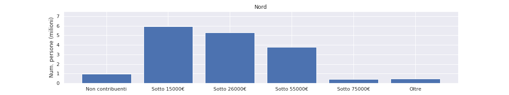
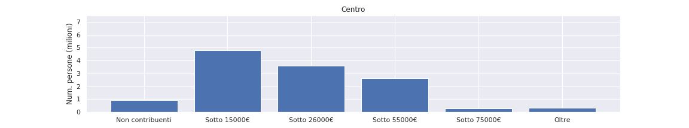
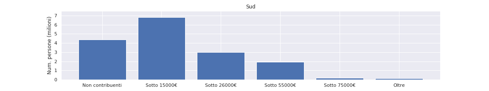
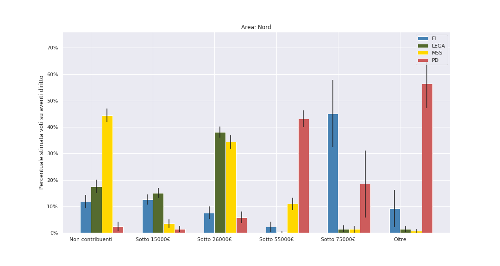
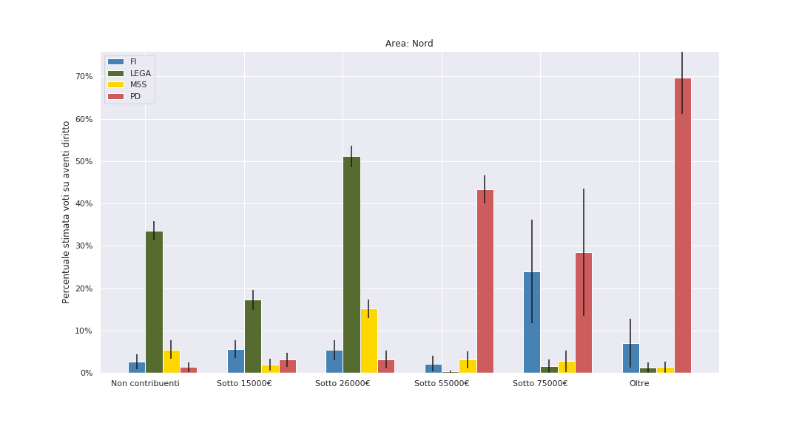
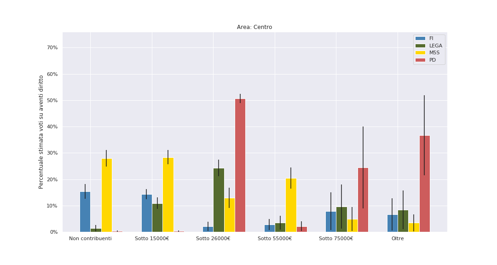
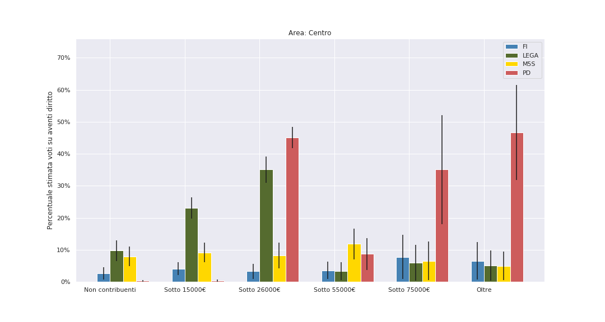

# Elezioni 2018-2019: un'analisi Bayesiana per classi sociali

## Caveat

- Non consideriamo comuni sopra i 100 000 abitanti. Questo perchè l'analisi che propongo è basata su una divisione ISTAT comune per comune. I grossi comuni sono troppo pochi per fare un'analisi separata (sono 45 sui 7800 considerati), ma se inclusi nell'analisi sposterebbero i risultati introducendo un bias.

- Non consideriamo le regioni Val D'Aosta e Trentino Alto Adige: lo scenario politico in queste regioni è radicalmente diverso, poichè vi sono partiti locali di notevole importanza.

## Distribuzione totale classi sociali

## Risultati

#### Nord

#### Centro

#### Sud

#### Commenti

- Si conferma che il **Movimento 5 Stelle** alle **politiche del 2018** è stato il partito scelto dalle **classi lavoratrici di reddito medio o medio basso**, specialmente al Sud. Stimiamo che al Sud, nella fascia 15-26 mila €, il M5S abbia sfiorato il 60% _sugli aventi diritto_. Al Nord, sempre nella fascia 15-26 mila €, sembra che nel 2018 avesse convinto tra il 30% e il 40% degli aventi diritto – circa come la Lega. Inoltre, il M5S nel 2018 aveva convinto i non contribuenti – perlopiù **giovani e/o disoccupati di lungo corso**, in tutta Italia (Nord e Sud oltre il 40%, nel Centro 25/30%, sempre su aventi diritto).
- **Tutti questi voti sono andati persi** alle Europee. In particolare su giovani e inattivi, dove sembra abbiano perso quasi tutti i loro voti. Al Nord, per esempio, tra giovani e inattivi sono passati da oltre il 40% a meno del 10%.
- La fascia a reddito medio-basso al Nord, dove il M5S è passato dal 35% al 15%, si è spostata in buona parte alla **Lega**, che passa dal 35% circa a oltre il 50%.
- **Al Sud invece questa fascia non si è trasferita su nessun'altro**: il M5S passa dal 60% al 20% ma la Lega nè altri guadagnano granchè.
- In particolare nessun voto in fuga da questa fascia medio-bassa sembra venire intercettato **Partito Democratico**, che tra 2018 e 2019 incrementa i proprio voti perlopiù **nelle classi alte e medio alte**, dove già si trova la maggior parte del suo elettorato (con l'eccezione del Centro Italia).
- È particolarmente interessante il caso del Nord. Qui la **fascia di "padroncini" e _upper middle class_ con reddito i 55 e il 75 €** che nel 2018 aveva votato **Forza Italia** si è trasferita in buona parte sul **Partito Democratico**. FI era evidentemente il partito di riferimento di questa fascia al Nord (stimiamo percentuali tra il 40% e il 60% degli aventi diritto) ma nel 2019 Berlusconi vede questi consensi dimezzati, mentre il PD guadagna circa dieci punti percentuale.
- Anche il resto del guadagno di voti del Partito Democratico sembra riguardare ricchi e ultra ricchi.
- Nella **fascia medio e medio-bassa al Centro** (regioni rosse e Lazio), dove ancora aveva buoni risultati, **il Partito Democratico sembra perdere addirittura voti**, in controtendenza con le altre fasce.
- Sempre al Centro è evidente come le fasce più basse, **sotto i 15 mila € di reddito**, sembrano non essere minimamente parte dell'elettorato del Partito Democratico. Se il M5S nel 2018 sembra sfiorare il 30% degli aventi diritto su questa fascia, ora nessun partito è a quei livelli: a parte un leggero incremento leghista, **il non voto la fa da padrone** in questa fascia. Al Nord, dove la Lega nella fascie medie raggiunge il 50%, nella fascia più bassa non arriva al 20% degli aventi diritto. Al Sud, nessun partito raggiunge il 15% in questa fascia.

.