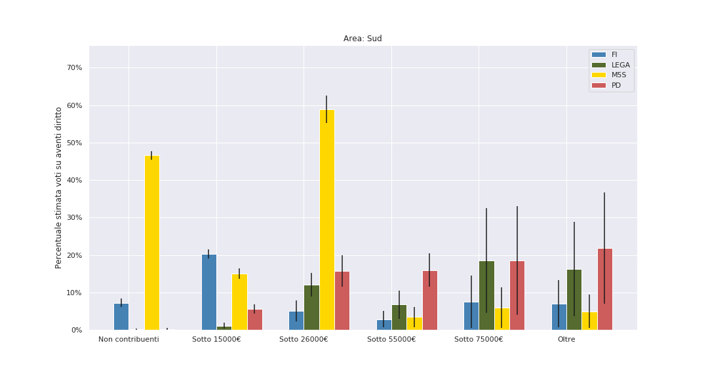

# Classi sociali nelle elezioni 2018 e 2019: un'analisi bayesiana del voto

#### TODO: Introduzione pindarica

Questa analisi si basa su una stima di come hanno votato le diverse classi di reddito, nel Nord, nel Centro, e nel Sud. Non ci basiamo su nessun sondaggio: consideriamo soltanto *le schede nelle urne* e le *dichiarazioni dei redditi*. La spiegazione dei dettagli matematici è in fondo dell'articolo, ma il succo è questo: proviamo a far corrispondere il voto di una certa classe di reddito con quante schede sono effettivamente state contate, e cerchiamo l'ipotesi che funziona meglio sui migliaia di comuni considerati. Dal momento che per ciascun comune sappiamo sia quante persone appartengono a ogni fascia di reddito, sia quanti voti ha preso un certo partito, troviamo le percenutali cha fanno "quadrare i conti" per tutti i partiti (e per l'astensione).

Come ogni analisi statistica ci sono delle puntualizzazioni da fare. La prima è che non abbiamo certezza sul rapporto causa-effetto: l'ipotesi proposta è quella più semplice, rasoio di Occam alla mano. Più dettagli su questo a fine articolo.

Per questo motivo, **non consideriamo comuni sopra i 100 000 abitanti**, cercando di eliminare ogni possibile fattore di confusione. L'analisi proposta si basa infatti su una divisione ISTAT comune per comune: ma i grossi comuni sono troppo pochi per fare un'analisi separata (sono 45 sui 7800 considerati), quindi semplicemente non vengono considerati. Tutte le conclusioni che ne trarremo valgono perciò solo per i comuni sotto i 100 000 abitanti.

Infine, non consideriamo le regioni Val D'Aosta e Trentino Alto Adige: la presenza di partiti locali autonomi rende lo scenario politico in queste regioni radicalmente diverso. Divideremo l'Italia in tre aree: Nord (senza Val D'Aosta e Trentino), Centro e Sud.

## Le classi considerate

Iniziamo mostrando cosa intendiamo in questo articolo per *classe di reddito*. Nonostante i dati ISTAT ci consentirebbero di replicare la stessa analisi su altre distinzioni di classe (per esempio salariati e non), sarebbe difficile distinguere il lavoro autonomo di una finta partita IVA da quello di chi ha decine di dipendenti. Per questo motivo ci siamo basati unicamente su una versione semplificata delle fasce di reddito ISTAT. Distinguiamo cinque classi di reddito:

- Chi guadagna **sotto i 15 mila euro annui**. Qui troviamo pensionati con la "minima" (la media nazionale dei redditi da pensione è 14.665 euro), e molti lavoratori, sia autonomi che salariati. Ricordiamo che la soglia di povertà si aggira sui 9 mila euro annui, quindi questa fascia di reddito comprende anche loro. In ognuna delle tre aree considerate, è la classe più popolosa: 6 milioni di persone al Nord, 5 al centro e quasi 7 al Sud.

- Chi sta tra i **15 e i 26 mila euro**. In questa fascia in generale ci aspettiamo di trovare il grosso dei lavoratori salariati: il lavoratore dipendente medio in Italia guadagna 17.370 euro. Da [2]: *"Il  reddito  medio  da  lavoro  dipendente  raggiunge  il  picco  di  circa  20.490  euro  in  corrispondenza  della  classe prossima  al  pensionamento e scende  rapidamente  a  16.360  euro  tra  gli  ultrasessantacinquenni"*.  Sono la seconda fascia più popolosa: 5 milioni di persone al Nord, tra i 3 e 4 sia al Centro che al Sud.

- Chi sta tra i **26 e i 55 mila euro**. *Middle class* e *upper-middle class*: rientrano in questa fascia tipicamente imprenditori – il reddito medio di un lavoratore autonomo è di circa 36 mila euro l'anno – e categorie professionali altamente specializzate. Per esempio, il reddito medio di un ingegnere è di 37 mila euro l'anno; gli studi medici 66 mila euro [3]. Questa classe è la più piccola tra le tre viste finora, e include circa 4 milioni di persone al Nord, meno di 3 al centro e 2 al Sud.

- Infine distinguiamo due fasce "agiate": i redditi **tra i 55 e i 75 mila euro** e i redditi **oltre i 75 mila euro**. Ognuna conta meno di mezzo milione di persone in ogni area considerata.

- Infine, abbiamo stimato il numero di **elettori non contribuenti**, semplicemente confrontando numero di elettori e numero di dichiarazioni dei redditi. In questa classe ci aspettiamo quindi di trovare giovani, studenti, inattivi, disoccupati di lungo corso, e lavoratori costretti al lavoro nero. Sono circa 1 milione sia al Nord che al Centro; al Sud raggiungono invece l'impressionante numero di 4 milioni e mezzo di persone.

## Risultati

#### Nord

#### Centro

#### Sud

#### Commenti

Prima di tutto, questa analisi conferma molti fatti noti. Il **Movimento 5 Stelle** alle **politiche del 2018** è stato il partito scelto dalle **classi lavoratrici di reddito medio e medio basso**, specialmente al Sud. Stimiamo che al Sud, nella fascia 15-26 mila €, il M5S abbia sfiorato il 60% *sugli aventi diritto*. Al Nord, nella stessa fascia, sembra che il M5S nel 2018 avesse convinto tra il 30% e il 40% degli aventi diritto – circa come la Lega. Inoltre, il Movimento nel 2018 aveva attirato i voti dei non contribuenti – quindi **giovani e/o disoccupati di lungo corso** – in tutta Italia: Nord e Sud oltre il 40%, nel Centro 25/30% (sempre su aventi diritto).

Alle Europee del 2019, **tutti questi voti al M5S sono andati persi**. Giovani e inattivi sembra abbiano abbandonato in massa il M5S. Al Nord in questa fascia sono passati da oltre il 40% a meno del 10%.
- La fascia a reddito medio-basso al Nord, dove il M5S è passato dal 35% al 15%, si è spostata in buona parte alla **Lega**, che passa dal 35% circa a oltre il 50%.
- **Al Sud invece questa fascia non si è trasferita su nessun'altro**: il M5S passa dal 60% al 20% ma la Lega nè altri guadagnano granchè.
- In particolare nessun voto in fuga da questa fascia medio-bassa sembra venire intercettato **Partito Democratico**, che tra 2018 e 2019 incrementa i proprio voti perlopiù **nelle classi alte e medio alte**, dove già si trova la maggior parte del suo elettorato (con l'eccezione del Centro Italia).
- È particolarmente interessante il caso del Nord. Qui la **fascia di "padroncini" e _upper middle class_ con reddito i 55 e il 75 €** che nel 2018 aveva votato **Forza Italia** si è trasferita in buona parte sul **Partito Democratico**. FI era evidentemente il partito di riferimento di questa fascia al Nord (stimiamo percentuali tra il 40% e il 60% degli aventi diritto) ma nel 2019 Berlusconi vede questi consensi dimezzati, mentre il PD guadagna circa dieci punti percentuale.
- Anche il resto del guadagno di voti del Partito Democratico sembra riguardare ricchi e ultra ricchi.
- Nella **fascia medio e medio-bassa al Centro** (regioni rosse e Lazio), dove ancora aveva buoni risultati, **il Partito Democratico sembra perdere addirittura voti**, in controtendenza con le altre fasce.
- Sempre al Centro è evidente come le fasce più basse, **sotto i 15 mila € di reddito**, sembrano non essere minimamente parte dell'elettorato del Partito Democratico. Se il M5S nel 2018 sembra sfiorare il 30% degli aventi diritto su questa fascia, ora nessun partito è a quei livelli: a parte un leggero incremento leghista, **il non voto la fa da padrone** in questa fascia. Al Nord, dove la Lega nella fascie medie raggiunge il 50%, nella fascia più bassa non arriva al 20% degli aventi diritto. Al Sud, nessun partito raggiunge il 15% in questa fascia.

## Bibliografia

- [1] ISTAT. Rapporto annuale 2017: la situazione del paese.

- [2] ISTAT. *Condizioni di vita, reddito e carico fiscale delle famiglie*. 6 dicembre 2018

- [3] Rapporto 2018 sulle libere professioni, curato dall'Osservatorio sulle libere professioni.

.