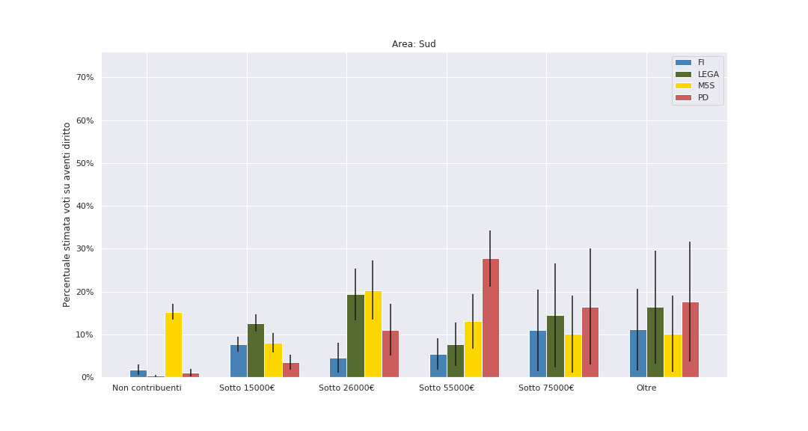

# Classi sociali nelle elezioni 2018 e 2019: un'analisi bayesiana del voto

Questa analisi si basa su una stima di come hanno votato le diverse classi di reddito, nel Nord, nel Centro, e nel Sud. Non ci basiamo su nessun sondaggio: consideriamo soltanto _le schede nelle urne_ e le _dichiarazioni dei redditi_. La spiegazione dei dettagli matematici è in fondo dell'articolo, ma il succo è questo: proviamo a far corrispondere il voto di una certa classe di reddito con quante schede si sono effettivamente contate, e proviamo a usare le migliaia di comuni nel nord per ottenere delle ipotesi realistiche. Per esempio, se ipotizziamo che tra tutte le persone che guadagnano meno di 15 mila euro l'anno, il 40% abbia votato per un certo partito, possiamo usare i settemila comuni italiani per verificare questa ipotesi. Dal momento che per ciascun comune sappiamo sia quante persone appartengono a ogni fascia di reddito, sia quanti voti ha preso un certo partito, basta trovare delle percenutali per cui "quadrino i conti" per tutti i partiti (e per l'astensione).

Come ogni analisi statistica ci sono dei _caveat_ a cui stare attenti. Il primo è che in questo modo non vi è _certezza_ sul rapporto causa-effetto tra presenza di una classe di reddito in un comune e voti presi. Più dettagli su questo a fine articolo. In ogni caso, quella che presentiamo qui è senz'altro l'ipotesi più realistica, che viene fuori dai dati nel modo più semplice e immediato.

Per questo motivo **non consideriamo comuni sopra i 100 000 abitanti**. Questo perchè l'analisi proposta si basa su una divisione ISTAT comune per comune. I grossi comuni sono troppo pochi per fare un'analisi separata (sono 45 sui 7800 considerati), ma se inclusi nell'analisi sposterebbero i risultati introducendo un _bias_.

Infine, non consideriamo le regioni Val D'Aosta e Trentino Alto Adige: lo scenario politico in queste regioni è radicalmente diverso, poichè vi sono partiti locali di notevole importanza.

## Distribuzione totale classi sociali

Iniziamo mostrando cosa intendiamo in questo articolo per _classe di reddito_. Nonostante i dati ISTAT ci consentirebbero di replicare la stessa analisi su altre distinzioni di classe (per esempio salariati e non), sarebbe difficile distinguere il lavoro autonomo di una finta partita IVA da quello di chi ha decine di dipendenti. Per questo motivo ci siamo basati unicamente su una semplificazione delle fasce di reddito ISTAT. In particolare distinguiamo cinque classi di reddito:

- Chi guadagna **sotto i 15 mila euro annui**. Qui troviamo pensionati con la "minima" (la media nazionale dei redditi da pensione è 14.665 euro), e molti lavoratori, sia autonomi che salariati. Ricordiamo che la soglia di povertà si aggira sui 9 mila euro annui, quindi questa fascia di reddito comprende anche loro. In ognuna delle tre aree considerate, è la classe più popolosa: 6 milioni di persone al Nord, 5 al centro e quasi 7 al Sud.

- Chi sta tra i **15 e i 26 mila euro**. In questa fascia in generale ci aspettiamo di trovare il grosso dei lavoratori salariati: il lavoratore dipendente medio in Italia guadagna 17.370 euro. Sono la seconda fascia più popolosa: 5 milioni di persone al Nord, tra i 3 e 4 sia al Centro che al Sud.

## Risultati

#### Nord

#### Centro

#### Sud

#### Commenti

- Si conferma che il **Movimento 5 Stelle** alle **politiche del 2018** è stato il partito scelto dalle **classi lavoratrici di reddito medio o medio basso**, specialmente al Sud. Stimiamo che al Sud, nella fascia 15-26 mila €, il M5S abbia sfiorato il 60% _sugli aventi diritto_. Al Nord, sempre nella fascia 15-26 mila €, sembra che nel 2018 avesse convinto tra il 30% e il 40% degli aventi diritto – circa come la Lega. Inoltre, il M5S nel 2018 aveva convinto i non contribuenti – perlopiù **giovani e/o disoccupati di lungo corso**, in tutta Italia (Nord e Sud oltre il 40%, nel Centro 25/30%, sempre su aventi diritto).
- **Tutti questi voti sono andati persi** alle Europee. In particolare su giovani e inattivi, dove sembra abbiano perso quasi tutti i loro voti. Al Nord, per esempio, tra giovani e inattivi sono passati da oltre il 40% a meno del 10%.
- La fascia a reddito medio-basso al Nord, dove il M5S è passato dal 35% al 15%, si è spostata in buona parte alla **Lega**, che passa dal 35% circa a oltre il 50%.
- **Al Sud invece questa fascia non si è trasferita su nessun'altro**: il M5S passa dal 60% al 20% ma la Lega nè altri guadagnano granchè.
- In particolare nessun voto in fuga da questa fascia medio-bassa sembra venire intercettato **Partito Democratico**, che tra 2018 e 2019 incrementa i proprio voti perlopiù **nelle classi alte e medio alte**, dove già si trova la maggior parte del suo elettorato (con l'eccezione del Centro Italia).
- È particolarmente interessante il caso del Nord. Qui la **fascia di "padroncini" e _upper middle class_ con reddito i 55 e il 75 €** che nel 2018 aveva votato **Forza Italia** si è trasferita in buona parte sul **Partito Democratico**. FI era evidentemente il partito di riferimento di questa fascia al Nord (stimiamo percentuali tra il 40% e il 60% degli aventi diritto) ma nel 2019 Berlusconi vede questi consensi dimezzati, mentre il PD guadagna circa dieci punti percentuale.
- Anche il resto del guadagno di voti del Partito Democratico sembra riguardare ricchi e ultra ricchi.
- Nella **fascia medio e medio-bassa al Centro** (regioni rosse e Lazio), dove ancora aveva buoni risultati, **il Partito Democratico sembra perdere addirittura voti**, in controtendenza con le altre fasce.
- Sempre al Centro è evidente come le fasce più basse, **sotto i 15 mila € di reddito**, sembrano non essere minimamente parte dell'elettorato del Partito Democratico. Se il M5S nel 2018 sembra sfiorare il 30% degli aventi diritto su questa fascia, ora nessun partito è a quei livelli: a parte un leggero incremento leghista, **il non voto la fa da padrone** in questa fascia. Al Nord, dove la Lega nella fascie medie raggiunge il 50%, nella fascia più bassa non arriva al 20% degli aventi diritto. Al Sud, nessun partito raggiunge il 15% in questa fascia.

## Metodo
: se in ogni comune in cui vi sono ricchi, un certo partito aumenta i suoi voti fra i più poveri, noi preferiremo la spiegazione più semplice: che i voti che osserviamo arrivino dai più ricchi – visto che quando vediamo ri

.